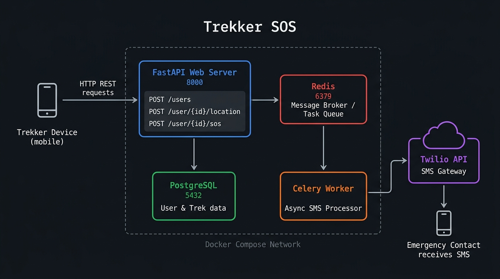

# Trekker SOS

A real-time location tracking and emergency SOS alert API built for trekkers operating in remote mountain terrain. When a trekker triggers an SOS, the system instantly dispatches an SMS with a live Google Maps link to a designated emergency contact — all with zero-latency API responses via asynchronous background processing.

---

## Architecture



---

## What It Does

- **Device Registration** — Registers a trekker's mobile device with their name and phone number.
- **Live Location Tracking** — Accepts continuous GPS coordinates from the device and persists them to the database.
- **SOS Trigger** — On alert, fires an async Celery task that sends an SMS via Twilio containing a Google Maps link to the trekker's last known coordinates.
- **Offline Batch Sync** — Accepts batched checkpoint events recorded while the device was offline and processes them on reconnection.

---

## Tech Stack

| Layer | Technology |
|---|---|
| API Framework | FastAPI |
| Database | PostgreSQL 15 |
| ORM | SQLAlchemy |
| Migrations | Alembic |
| Task Queue | Celery |
| Message Broker | Redis |
| SMS Gateway | Twilio |
| Containerization | Docker / Docker Compose |
| Runtime | Python 3.12 |

---

## Project Structure

```
trekker-sos/
├── main.py              # FastAPI app and all route handlers
├── user_db.py           # SQLAlchemy models (User, Trek)
├── worker.py            # Celery app and send_sms task
├── requirements.txt     # Python dependencies
├── Dockerfile           # Multi-stage Docker build
├── docker-compose.yml   # Full service orchestration
├── alembic.ini          # Alembic configuration
├── alembic/
│   ├── env.py           # Migration environment setup
│   └── versions/        # Auto-generated migration files
├── .env.example         # Environment variable template
└── architecture.jpg     # System architecture diagram
```

---

## Getting Started

### Prerequisites

- [Docker](https://www.docker.com/) and Docker Compose installed
- A [Twilio](https://www.twilio.com/) account with a phone number

### 1. Clone the repository

```bash
git clone https://github.com/paramnarayan/trekker-sos-.git
cd trekker-sos
```

### 2. Configure environment variables

```bash
cp .env.example .env
```

Edit `.env` and fill in your credentials:

```env
DB_PASSWORD=your_postgres_password
DATABASE_URL=postgresql://postgres:your_postgres_password@db:5432/trekker_db
REDIS_URL=redis://redis:6379/0
TWILIO_ACCOUNT_SID=your_twilio_account_sid
TWILIO_AUTH_TOKEN=your_twilio_auth_token
TWILIO_PHONE_NUMBER=+1xxxxxxxxxx
```

### 3. Start all services

```bash
docker compose up -d --build
```

This starts four containers: the FastAPI web server, Celery worker, PostgreSQL database, and Redis broker.

### 4. Run database migrations

```bash
docker compose exec web alembic upgrade head
```

### 5. Access the API

The interactive API docs are available at:

```
http://localhost:8000/docs
```

---

## API Endpoints

| Method | Endpoint | Description |
|---|---|---|
| `POST` | `/users` | Register a new trekker device |
| `POST` | `/user/{device_id}/location` | Update the device's GPS coordinates |
| `POST` | `/user/{device_id}/sos` | Trigger an SOS alert via SMS |
| `POST` | `/sync/batch` | Sync offline checkpoint events |
| `POST` | `/treks/{trek_id}/start-timer` | Arm a dead-man's switch timer |

---

## Engineering Highlights

- **Architected** a real-time location tracking and SOS alert API using FastAPI and PostgreSQL, enabling rapid distress signal dispatching.
- **Implemented** asynchronous background processing with Celery and Redis to handle external Twilio SMS network requests, ensuring zero-latency API responses during emergency triggers.
- **Containerized** the entire microservice ecosystem using Docker Compose, creating an isolated, reproducible environment for the web server, worker, database, and message broker.
- **Managed** database schema migrations using Alembic to ensure safe, version-controlled updates to production location tables.

---

## Security Notes

- Never commit your `.env` file. It is listed in `.gitignore`.
- Use `.env.example` as the committed template for onboarding collaborators.
- Rotate your Twilio credentials immediately if they are ever exposed in version history.
